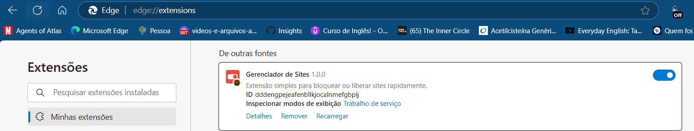
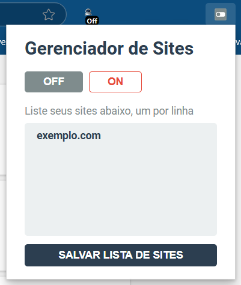

# Gerenciador de Sites

Esta é uma extensão do Google Chrome que permite alternar entre bloquear e desbloquear uma lista de URLs de sites. Foi criada com a intenção de ser uma ferramenta leve e útil para evitar distrações quando você precisa se concentrar, sem complicações ou configurações rigorosas.

O código-fonte está aberto para que você possa examinar o funcionamento interno da extensão e ver como ela funciona sem comprometer sua privacidade de navegação.

---

## Funcionalidades:

- **Alternância de sites**: Bloqueie ou desbloqueie sites facilmente, adicionando-os a uma lista.
- **Modo de bloqueio**: Quando ativado, impede que sites listados sejam carregados.
- **Simples e eficiente**: Ideal para quem precisa de uma ferramenta rápida e sem frills para evitar distrações.

---

## Como instalar:

Siga estas etapas para experimentar a extensão:

1. Clone ou baixe o arquivo deste repositório.
2. No seu navegador, acesse `chrome://extensions`.
3. Certifique-se de que o **Modo de Desenvolvedor** esteja ativado, utilizando o botão de alternância no canto superior direito.
4. Clique no botão **Carregar Descompactado** no canto superior esquerdo e selecione o diretório `dist` deste repositório.

---

## Como usar:

1. Após a instalação, clique no ícone da extensão na barra de ferramentas do Chrome.
2. Adicione os sites que deseja bloquear, um por linha, na caixa de texto.
3. Ative ou desative a alternância para bloquear ou permitir que os sites da lista sejam carregados.

---

## Contribuições

Se você tiver sugestões, melhorias ou quiser corrigir algum erro, fique à vontade para abrir uma **issue** ou enviar um **pull request**.

---

### Licença
Este projeto está licenciado sob a licença MIT - veja o arquivo LICENSE para mais detalhes.

Feito com ♥ por [Jezebel Guedes](https://www.linkedin.com/in/jezebel-guedes/) 👋 Entre em contato!
